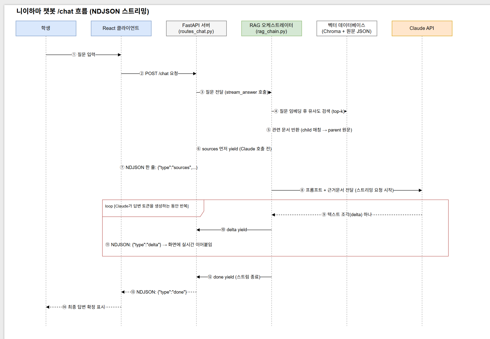

# 니이하마 학생편람 RAG 챗봇

[한국어](README.md) | [日本語](README.ja.md)

니이하마 공업고등전문학교 학생편람(PDF)을 근거로 답변하는 RAG(Retrieval-Augmented Generation) 챗봇입니다. 학생이 카테고리를 선택하거나 자유롭게 질문하면, 학생편람에서 관련 근거를 찾아 그 내용만을 바탕으로 한국어/일본어로 답변합니다.

**데모**: http://35.79.216.241

## 주요 기능

- 학생편람 PDF 기반 RAG 답변 (근거 없는 내용은 추측하지 않고 담당 부서 문의 안내)
- 9개 카테고리별 질문/답변 및 카테고리별 대화 기록 분리, "전체"에서는 모든 기록 조회
- 한국어/일본어 자동 감지 응답 + 언어 수동 지정
- 답변 근거(원문 조회) 패널, 좋아요/싫어요 피드백
- 카테고리별 예상 질문 자동 생성
- 스트리밍 응답 (NDJSON), 임베딩 모델 캐싱으로 체감 응답 속도 개선

## 동작 흐름

질문 입력부터 답변 표시까지의 요청 흐름 (근거 문서를 먼저 보여준 뒤, Claude 응답을 토큰 단위로 스트리밍):



## 기술 스택

**프론트엔드**
- React 19 + TypeScript + Vite
- Tailwind CSS 4

**백엔드**
- FastAPI + Uvicorn
- Anthropic Claude API (답변 생성)
- Chroma (벡터 DB) + `intfloat/multilingual-e5-large` (로컬 임베딩)
- PyMuPDF (PDF 파싱)

**인프라**
- AWS EC2(Ubuntu) 한 대에 nginx + systemd로 프론트(정적 파일)·백엔드(API) 동시 서빙

## 프로젝트 구조

```
niihama-school-chatbot/
├── src/                    # 프론트엔드 (React)
│   ├── api/                 # 백엔드 API 호출
│   ├── components/          # UI 컴포넌트
│   ├── hooks/                # useChat 등 상태 관리 훅
│   ├── i18n/                 # 한국어/일본어 다국어 텍스트
│   └── types/                 # 공용 타입 정의
├── backend/                # 백엔드 (FastAPI) — 자세한 내용은 backend/README.md 참고
│   ├── app/                  # API 라우터, RAG 파이프라인, Claude 연동
│   ├── data/raw/               # 원본 학생편람 PDF
│   ├── scripts/ingest.py        # PDF -> 청킹 -> 임베딩 -> 인덱싱
│   └── requirements.txt
├── deploy/                 # AWS EC2 배포 가이드/설정 템플릿
│   ├── DEPLOY.md              # 배포 절차 전체
│   ├── nginx.conf.example
│   └── niihama-backend.service
└── BACKEND_PLAN.md         # 백엔드 설계 배경
```

## 로컬 개발 환경 설정

### 백엔드

```bash
cd backend
python -m venv .venv
source .venv/Scripts/activate   # Windows Git Bash. PowerShell은 .venv\Scripts\Activate.ps1
pip install -r requirements.txt
```

`backend/.env.example`을 참고해 `backend/.env` 생성:

```
ANTHROPIC_API_KEY=sk-ant-...
CLAUDE_MODEL=claude-sonnet-5
```

벡터 인덱스 생성 (최초 1회 + PDF/청킹 로직 변경 시):

```bash
python scripts/ingest.py
python scripts/generate_suggested_questions.py
```

서버 실행:

```bash
uvicorn app.main:app --reload --port 8000
```

API 엔드포인트, 요청/응답 스키마 등 자세한 내용은 [`backend/README.md`](backend/README.md) 참고.

### 프론트엔드

```bash
npm install
npm run dev
```

`.env.example`을 참고해 루트에 `.env` 생성 (로컬 백엔드 주소):

```
VITE_API_BASE_URL=http://127.0.0.1:8000
```

### 커맨드

```bash
npm run dev       # 개발 서버
npm run build     # 프로덕션 빌드 (tsc -b && vite build)
npm run lint       # oxlint
npm run preview    # 빌드 결과 미리보기
```

## 배포

AWS EC2 한 대에 nginx로 프론트/백엔드를 함께 띄우는 절차는 [`deploy/DEPLOY.md`](deploy/DEPLOY.md)에 정리되어 있습니다. 코드나 데이터를 업데이트한 뒤 재배포하는 방법도 같은 문서 맨 아래 "업데이트 배포" 섹션에 있습니다.
